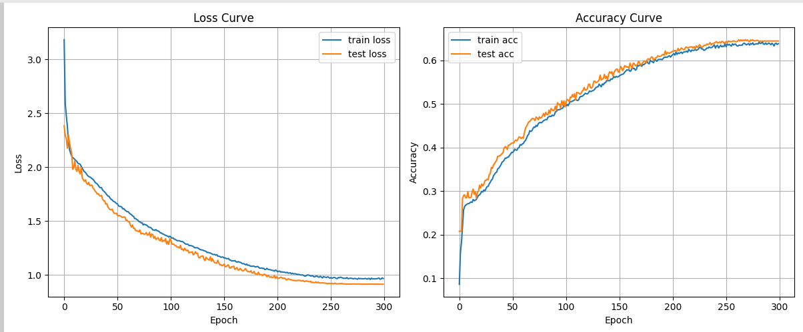
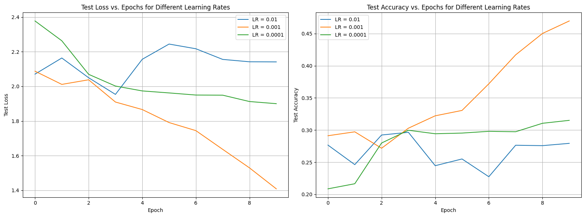
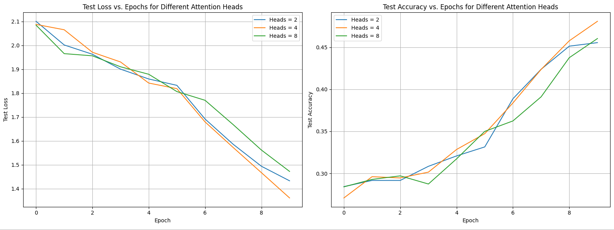
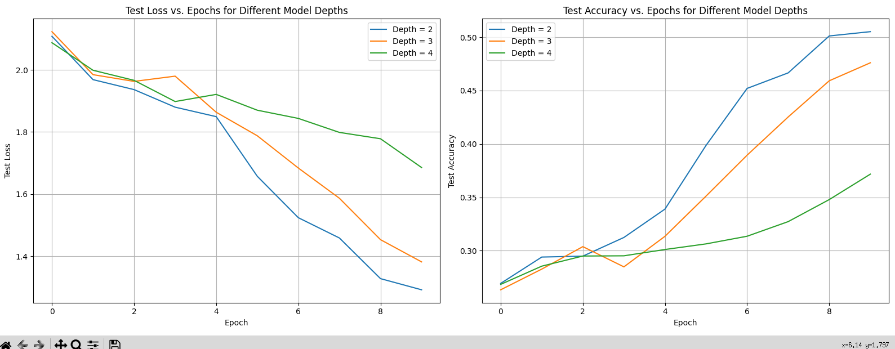

# task1
## 1.数据处理
(1)先加载数据，把训练数据八二分为训练集和验证集，测试集保持原样。  
(2)用preprocess_text函数对所有数据进行预处理(大写转小写，去除所有非单词字符和空白字符)  
## 2.将训练集的词转成向量  
(1)构建词汇表:用build_vocab函数构建词表。bow是n-gram在n=1时的特例.  
(2)将文本转成向量：用text_to_vector把数据变成形状为(num_sentences,vocab_size)的张量
## 3.定义模型
这里仿照mlp定义了Mymodel类  
## 4.定义损失函数
实现了三个损失函数，第一个是最适合多酚类场景的CrossEntropy,第二个是MSE,第三个是KL散度,第四个是我对CrossEntropy的改造，旨在对置信度高的错误类别施加惩罚(仅在预测错误时)  
## 5.定义训练和评估函数
train_evaluate函数用来训练模型并记录每轮的train loss和valid loss  
test函数用来观察模型在测试集上的准确率  
## 6.开始训练

## 7.结果  
(1)比较bow和2-gram  

(2)比较四种损失函数  
  
好！看起来改进过的crossentropy达到了最高acc

# task2
## 1.数据处理(同上)
## 2.文本预处理
(1)构建词典:build_vocab_tokenizer函数把出现次数大于1的字都放入字典  
(2)文本转索引：encode函数把每个词转为vocab中它对应的值
(3)统一句子长度：pad_truncate函数使得每个句子长度都是max_len
## 3.定义模型
定义了TextCNN类，包含一个卷积层，一个最大池化层和一个全连接层  
## 4.训练和评估函数(同上)  

## 5.结果  
比较懒，就没有用test,而是只取最后一个epoch的valid acc作为性能的指标(不取loss是因为看起来就很不合理，无颜示众)  
(1)不同损失函数对最终性能的影响  
  
(2)不同学习率对最终性能的影响  
 
(3)不同卷积核个数对最终性能的影响  
  
(4)不同优化器对最终性能的影响  
  
(5)随机的embedding vs glove预训练的embedding  
  
(6)CNN vs RNN vs Transformer  
  
这个结果我认为并不可信，因为CNN的超参数经过我前面那么多次的调整已经算是达到比较合适的状态了，但rnn和transformer的超参数则是随便设的，不合理也正常  
# task3  
## 1.实现transformer类
(1) PositionalEmbedding：词嵌入与位置编码  
该层将输入的词元索引转换为向量，并与一个预先计算好的、基于sin/cos函数的位置向量相加，从而让模型同时获得词的语义和位置信息。  
(2) MultiHeadAttention：多头注意力  
通过计算查询(Query)与键(Key)的相似度来为值(Value)分配权重。  
(3) FeedForward：前馈神经网络  
两层全连接网络，在注意力层之后对每个位置的输出进行独立的非线性变换/  
(4) TransformerEncoderLayer：编码器层  
编码器的基本构建块，由多头自注意力层，前馈网络，残差连接与层归一化连接而成  
(5) TransformerDecoderLayer：解码器层  
解码器的基本构建块，比编码器层多了一个交叉注意力层。  
(6) TransformerEncoder：编码器  
由多个TransformerEncoderLayer堆叠而成  
(7) TransformerDecoder：解码器  
由多个TransformerDecoderLayer堆叠而成，
(8) Transformer：完整的模型  
将编码器和解码器整合在一起，并加上输入嵌入层和最终的输出线性层，构成一个完整的、可用于序列到序列任务的端到端模型。  
(9)create_src_mask 和 create_tgt_mask：掩码创建函数
这两个工具函数用于生成掩码，create_src_mask用于屏蔽输入序列中的填充位，而create_tgt_mask则额外包含一个下三角矩阵，防止解码器在预测时“偷看”未来的信息。
## 2.子任务1
  
## 3. 子任务2
语料是ai给我编的小说

## 4.测试不同超参数对训练效果的影响
(1) 学习率  

(2) 注意力头数  

(3) 模型深度
